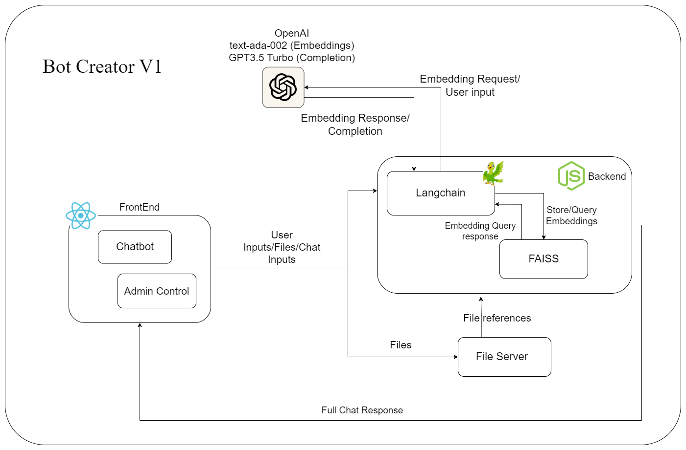

# 🤖 Chatbot Creator v1.0

A tool to create, customize and deploy chatbot applications fast🚀 and easily😃!

## Tech Stack 👨‍💻

**Front-End:** React

**Back-End:** Node, Express, Langchain

**Embeddings:** OpenAI text-ada-002

**LLM:** OpenAI GPT-3.5 turbo

**Vector Database:** FAISS (Facebook AI Similarity Search)

## High-level Architecture🤓

## How to use ?🤔

* Add basic information of the chatbot and its features(Role, Style, Chatting tone, Constraints) in the **Knowledge Section**.

* Drag and drop reference documents for the Knowledge Base (KB) of the chatbot. These Documents will be refernced by the chatbot while interacting with users.

* Add the API token secret keys (OpenAI) in the **Keys** section.

* Include the <ChatUI/\> component within your current codebase (later we will give a pluggable npm module).

## License

[MIT](https://choosealicense.com/licenses/mit/)

## Support and Contribution

For support, email udara.unb98@gmail.com or join our Slack channel.

## Authors

- [@Isuru Cumaranathunga](https://github.com/isurucuma)

- [@Madusha Keshan](https://github.com/keshan99)

- [@Udara Nilupul](https://github.com/UdaraN98)
